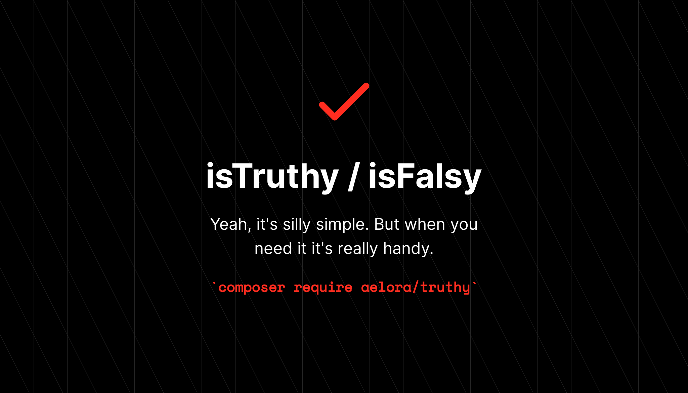

# isTruthy / isFalsy

[](https://packagist.org/packages/aelora/truthy)
[](https://packagist.org/packages/aelora/truthy)

Simple PHP package to add an `isTruthy` and `isFalsy` function.

And yes, I know this is simple to almost a silly level. But it's something that I found myself adding to a bunch of different PHP projects so it seemed like a perfect bit of code to build into a package. 

## Installation 

Install using composer

```
composer require aelora/truthy
```

There are no settings. 

## Usage

Once loaded, there will be an `isTruthy` and `isFalsy` function in the global namespace.

The following values are considered falsy (case insensitive)
* false
* null
* empty string
* 0
* 0.0
* empty array
* empty object
* strings "no", "n", "false", "f", "off", "null", "none", "0", "0.0"

Everything else is considered truthy. 

```php
if (isTruthy($value)) {
    // Do something
} 
if (isFalsy($value)) {
    // Do something
}
```

## Tests

```
composer test
```
